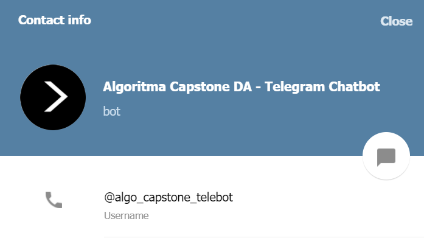
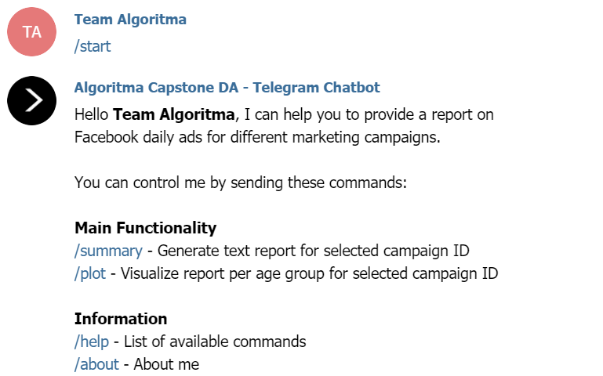
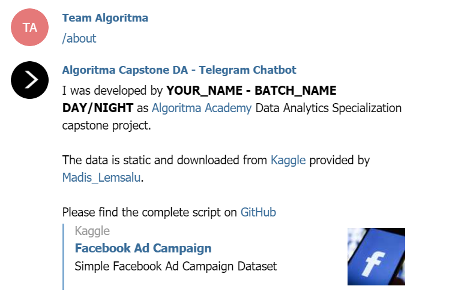
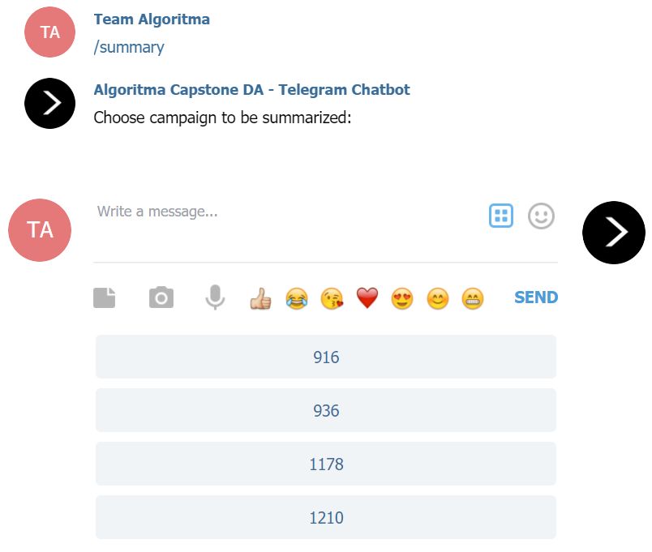
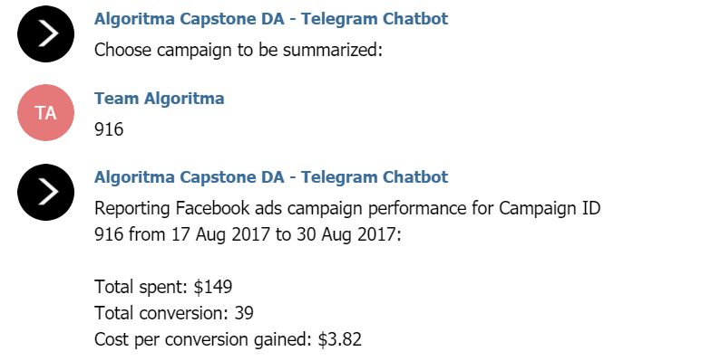
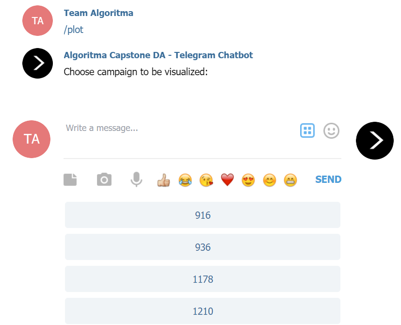
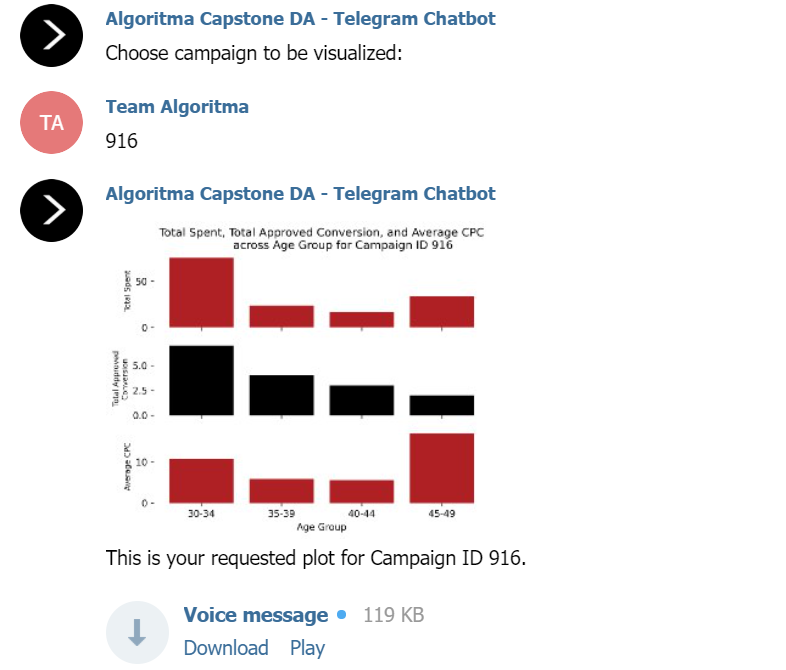
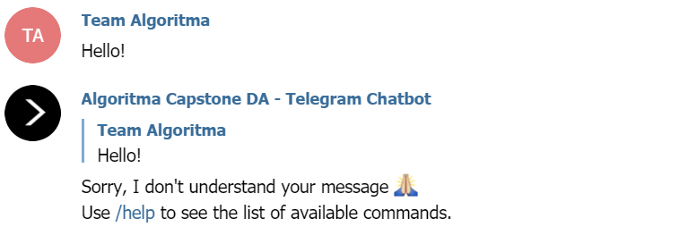
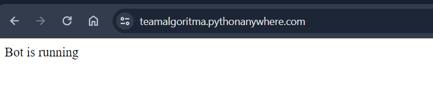

# Telegram Chatbot

This is developed as one of [Algoritma Academy](https://algorit.ma/) Data Analytics Specialization Capstone Projects. The deliverable of this project is a Python script to create a Telegram chatbot using `telebot` package. We will also deploy the chatbot to [Python Anywhere](https://pythonanywhere.com) and use `Flask` to set up the backend application.

## Project Requirements

**Relevant Topics**:
- Python for Data Analysts (P4DA)
- Exploratory Data Analysis (EDA)
- Data Wrangling and Visualization (DWV)

**New Exploratory Topics**:
- Basic Python: Custom functions
- Visualization using `matplotlib`
- Build bot using `flask` framework
- Python Script Deployment using `PythonAnywhere`

**Workflow**:
- Virtual Environment Preparation
- Set up Telegram bot API
- Create a simple bot
- Create campaign performance reporting bot
    - Load Data
    - Data Wrangling
    - Data Visualization
- Python Script Deployment

## Project File Structure

```
telebot
├── 📁 assets
├── 📁 cache
├── 📁 data_input
├── 📁 template_text
├── .gitignore
├── </> app.py
├── </> bot_local.py
├── 📝 Notebook Guide.ipynb
├── 🚀 Procfile
├── 📝 requirements.txt
└── 📝 runtime.txt
```

- Folders (**DO NOT CHANGE**):
    - `assets`: Images used in notebook
    - `cache`: Pickled Python object
    - `data_input`: Dataset for analysis
    - `template_text`: Text files for chat template

- Application-related Files (**TO BE COMPLETED BY STUDENT**):
    - `app.py`: Main `Flask` application
    - `bot_local.py`: Telegram bot to be run locally
    - `Notebook Guide.ipynb`: Main guide for the project workflow

- Deployment-related Files (**DO NOT CHANGE**):
    - `.gitignore`: List of file extensions to be ignored when `git push` from local
    - `Procfile`: Commands for app's dynos on PythonAnywhere
    - `requirements.txt`: List of package dependencies to be installed on PythonAnywhere
    - `runtime.txt`: Python version to be installed on PythonAnywhere

## Requirements

- **Python 3.10**
- `emoji==2.2.0`
- `Flask==3.0.0`
- `gunicorn==20.1.0`
- `matplotlib==3.6.2`
- `pandas==2.2.2`
- `numpy==1.26.4`
- `pyTelegramBotAPI==4.8.0`
- `python-dotenv==0.21.0`
- `gTTS==2.3.0`

For instructions on how to prepare the virtual environment and requirements, please read `Notebook Guide.ipynb`.

## Expected Output

### Telegram Bot Account

Create a bot that can provide report on Facebook daily ads for different marketing campaign. Here is an example: [https://t.me/capstone_da_bot](http://t.me/capstone_da_bot)

<p align="center" width="100%">
     
</p>

Here are the chatbot functionalities:

1. Command `/start` or `/help`: send welcome message containing list of available commands.

<p align="center" width="100%">
     
</p>

2. Command `/about`: send information about the bot developer.

<p align="center" width="100%">
     
</p>

3. Command `/summary`: generate text report for selected campaign ID.

<p align="center" width="100%">
    
</p>

Reply from bot after campaign ID is selected:

<p align="center" width="100%">
    
</p>

4. Command `/plot`: generate visualization and voice message report per age group for selected campaign ID.

<p align="center" width="100%">
    
</p>

Reply from bot after campaign ID is selected:

<p align="center" width="100%">
    
</p>

**Voice message:** 
<a href="https://drive.google.com/file/d/16hVORo-heUOjWje_g62aV6380-toBwWp/view?usp=sharing" target="_blank">Sample audio for Campaign ID 916</a>

> This is your requested plot for Campaign ID 916.
> Age group with the highest total spent is 30-34, while the lowest is 40-44. 
> Age group with the highest total approved conversion is 30-34, while the lowest is 45-49.
> Age group with the highest average CPC is 45-49, while the lowest is 40-44.

5. Default message: handle messages other than the previous commands.

<p align="center" width="100%">
    
</p>

### Deployed Application

<p align="center" width="100%">
     
</p>

This bot is expected to run **continuously** on a server. Therefore we create a `Flask` application which deployed to [Python Anywhere](https://pythonanywhere.com). 